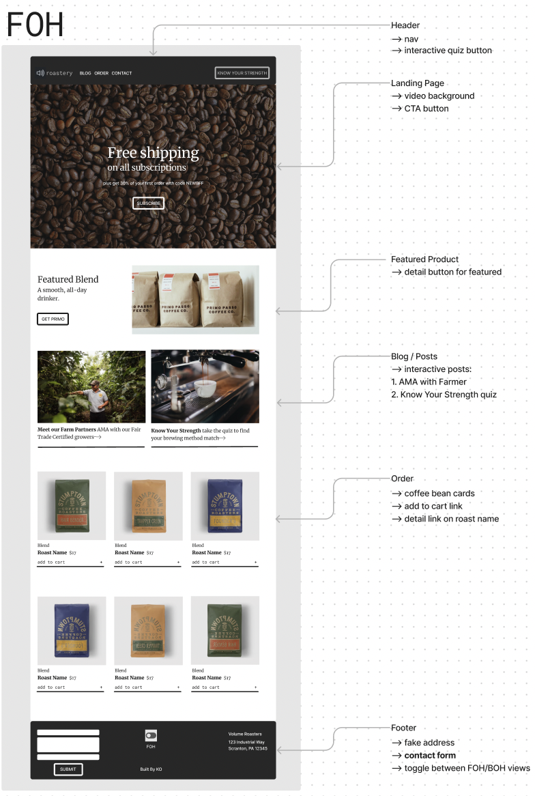

# Volume Coffee Roasters

#### By Kirsten Opstad

#### A web app for a fictional coffee roaster
***
<!-- #### [Check out the live site](https://kirstenopstad.github.io/local-business/)! -->

*Stock image of coffee beans, courtesy [Lukasz Rawa](https://unsplash.com/@lukasz_rawa) via [Unsplash](https://unsplash.com/).*
***

## Description

Volume Coffee Roasters is a fictional coffee roastery web app that includes a FOH (Front of House) and BOH (Back of House) area. This iteration of the project takes the BOH structure from a previous project ([Live Site](https://kirstenopstad.github.io/local-business/) | [GitHub](https://github.com/kirstenopstad/local-business)) and adds customer-facing features.

***
## Technologies Used

* React
* JavaScript
* Bootstrap
* HTML
* CSS
* webpack
* Node.js
* EmailJS

***

### Objectives (MVP)

At Volume Coffee Roasters, we use the FOH part of our web app to sell coffee beans and subscriptions to customers & the BOH to track inventory. We get our coffee delivered in large burlap sacks. Here are the details:

* Our inventory of includes multiple types of beans, purchased in large, wholesale-sized burlap sacks
* Each new burlap sack contains 130 pounds of coffee beans
* Every sale decrements one pound of beans from the sack, until it is empty

__User Storeis:__

* ✅ As a user, I want to be able to toggle between FOH and BOH
* ✅ As a user, I want the site to be easy to use and nicely styled

__FOH User Stories:__
* ✅ As a FOH user, I want to first see a Landing page (area) that includes a bold, call-to-action to allow customers to subscribe to our mailing list in two clicks.
* ✅ As a FOH user, I want to be able to contact the company directly from the footer & see company contact info

__BOH User Stories:__
* ✅ As a BOH user, I want to see a list/menu of all available types of coffee beans.
* ✅ For each item, I want to see its name, origin, price, and roast (light, medium, or dark) of the coffee bean. (You are welcome to include anything additional that is relevant to the product your store carries.)
* ✅ As a BOH user, I want to submit a form to add a new burlap sack of coffee to the inventory.
* ✅ As a BOH user, I want to be able to click on a burlap sack to see its detail page.
* ✅ As a BOH user, I want to see how many pounds of coffee beans are left in a burlap sack. A burlap sack has roughly 130 pounds.
* ✅ As a BOH user, I want to be able to click a button to sell a pound of coffee beans. This should decrease the number of pounds left by 1. The number of pounds in a sack of coffee beans should not be able to go below 0.

### __Further Exploration (Stretch Goals)__

__FOH User Stories (Stretch):__
* As a FOH user, I want to see a featured blend with a link to purchase 
* As a FOH user, I want to be able to click to:
    * ✅ view blog details
    * ✅ take Know Your Strength quiz.
* ✅ As a FOH user, I want to be able to 
  * ✅ Add items to a cart
  * ✅ Remove items from a cart
  * ✅ Change quantites of items in cart
  * ✅ View cart summary

__BOH User Stories (Stretch):__
* ✅ As a user, I want the option to edit a coffee sack's properties after entering them just in case I make a mistake.
* As a user, I want to be able to delete a coffee sack.
* ✅ As a user, I want a coffee sack to update to say "Out of Stock" once it's empty.
* As a user, I want coffee sacks with less than 10 pounds to include a message that says "Almost Empty" so I can buy a pound of it before it's gone!
* As a user, I want to have coffee prices to be color-coded for easy readability. This could be based on their price, their origin or roast, or the amount of pounds left.

***
## Process 

### Roadmap

### Component Drawing
[](https://www.figma.com/file/9yZdrlZDInV6346toTdG2Z/CoffeeShop?node-id=0%3A1&t=SaS3WUYroyADmYHv-1)
### Mockup (FOH)

### Mockup (BOH)


***
## Implementation
0. ✅ Build mock up for FOH
1. ✅ Revise component drawing
2. ✅ Restablish Component Hierarchy
    <!-- * App.js
      * ✅ Header.js 
      * ✅ InventoryControl.js - displays either list, detail, add or edit
        * ✅ List.js – displays all items in inventory
        * ✅ Detail.js – displays details for single in inventory
        * ✅ Add.js – form to add new item to inventory
        * Strech Components
        * Edit.js – form to edit item in inventory -->
3. ✅ Build New Static Components
4. ✅ Add State
    <!-- * ✅ Local State to display either list, detail or add
    * ✅ Shared State to allow Create & Update Functionality -->
5. ✅ Style to match mockup

***
## Goals
1. ✅ Meet MVP
2. ✅ Stretch: build cart feature
3. ✅ Stretch: build Know Your Strength quiz

***
## Setup/Installation Requirements

* Clone this repo to your workspace.
* Navigate to the top level of the directory.
* In the root directory of the project, run this command to install all packages listed in the package.json:
```
$ npm install
```
* Then, to build and serve the project, run: 
```
$ npm run start
```
***
## Known Bugs

* No known bugs. If you find one, please email me at kirsten.opstad@gmail.com with the subject **[_Repo Name_] Bug** and include:
  * BUG: _A brief description of the bug_
  * FIX: _Suggestion for solution (if you have one!)_
  * If you'd like to be credited, please also include your **_github user profile link_**

***
## License

MIT License

Copyright (c) 2023 Kirsten Opstad

Permission is hereby granted, free of charge, to any person obtaining a copy of this software and associated documentation files (the "Software"), to deal in the Software without restriction, including without limitation the rights to use, copy, modify, merge, publish, distribute, sublicense, and/or sell copies of the Software, and to permit persons to whom the Software is furnished to do so, subject to the following conditions:

The above copyright notice and this permission notice shall be included in all copies or substantial portions of the Software.

THE SOFTWARE IS PROVIDED "AS IS", WITHOUT WARRANTY OF ANY KIND, EXPRESS OR IMPLIED, INCLUDING BUT NOT LIMITED TO THE WARRANTIES OF MERCHANTABILITY, FITNESS FOR A PARTICULAR PURPOSE AND NONINFRINGEMENT. IN NO EVENT SHALL THE AUTHORS OR COPYRIGHT HOLDERS BE LIABLE FOR ANY CLAIM, DAMAGES OR OTHER LIABILITY, WHETHER IN AN ACTION OF CONTRACT, TORT OR OTHERWISE, ARISING FROM, OUT OF OR IN CONNECTION WITH THE SOFTWARE OR THE USE OR OTHER DEALINGS IN THE SOFTWARE.
