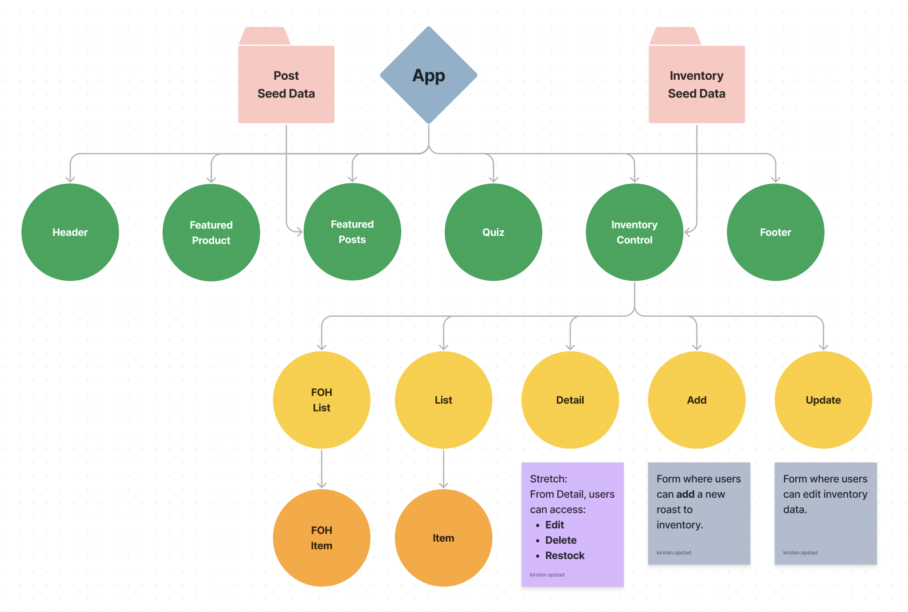

# Coffee Shop

#### By Kirsten Opstad

#### A web app that tracks inventory for a fictional coffee shop

## Technologies Used

* React
* JavaScript
* Bootstrap
* HTML
* CSS
* webpack
* Node.js

## Description

__Prompt__

At our coffee shop, we sell coffee beans in 1-pound servings, and we get our coffee delivered in large burlap sacks. Here are the details:

* we sell multiple types of coffee beans, each in different burlap sacks
* one burlap sack contains 130 pounds of coffee beans
* every sale decrements one pound of coffee beans from the burlap sack, until it is empty

__Before getting started, plan out your application and draw a component tree or component diagram that shows the structure of your components. This is a requirement for the project and should be included in your README__.

You are only expected to add CREATE, READ, and UPDATE functionality, though you are welcome to implement DELETE functionality as well. 

### Objectives (MVP)

The application should have the following functionality:
* ✅ As a user, I want to see a list/menu of all available types of coffee beans.
* ✅ For each item, I want to see its name, origin, price, and roast (light, medium, or dark) of the coffee bean. (You are welcome to include anything additional that is relevant to the product your store carries.)
* As a user, I want to submit a form to add a new burlap sack of coffee to the inventory.
* As a user, I want to be able to click on a burlap sack to see its detail page.
* As a user, I want to see how many pounds of coffee beans are left in a burlap sack. A burlap sack has roughly 130 pounds.
* As a user, I want to be able to click a button to sell a pound of coffee beans. This should decrease the number of pounds left by 1. The number of pounds in a sack of coffee beans should not be able to go below 0.

Additionally, code will be reviewed for the following objectives:

1. Application compiles and runs without error, and warnings in the DevTools console are resolved.
2. Functional and class components are used correctly.
3. Application effectively uses local and shared state.
4. Props are used correctly and always include PropTypes.
5. README includes an accurate representation of the application's component tree.
6. Project is in a polished, portfolio-quality state.
7. The prompt’s required functionality and baseline project requirements are in place by the deadline.

### Further Exploration (Stretch Goals)

__User stories:__
* As a user, I want the option to edit a coffee sack's properties after entering them just in case I make a mistake.
* As a user, I want to be able to delete a coffee sack.
* As a user, I want a coffee sack to update to say "Out of Stock" once it's empty.
* As a user, I want coffee sacks with less than 10 pounds to include a message that says "Almost Empty" so I can buy a pound of it before it's gone!
* As a user, I want to have coffee prices to be color-coded for easy readability. This could be based on their price, their origin or roast, or the amount of pounds left.
* As a user, I want this application to be nicely styled. (Use stylesheets and CSS objects!)

## Process 
1. Create component drawing
[](https://www.figma.com/file/9yZdrlZDInV6346toTdG2Z/CoffeeShop?node-id=0%3A1&t=SaS3WUYroyADmYHv-1)
2. Establish Component Hierarchy:
    * App.js
      * ✅ Header.js 
      * ✅ InventoryControl.js - displays either list, detail, add or edit
        * ✅ List.js – displays all items in inventory
        * ✅ Detail.js – displays details for single in inventory
        * ✅ Add.js – form to add new item to inventory
        <!-- Strech Components -->
        <!-- * Edit.js – form to edit item in inventory -->
3. ✅ Build Static Components
4. Add State
  * Local State to display either list, detail or add
  * Shared State to allow Create & Update Functionality
5. Style to match [inspiration](https://www.stumptowncoffee.com/collections/coffee)

<!-- [x] Screenshots

 -->

<!-- [Link to operational site](http://www.kirstenopstad.github.com/<REPOSITORY NAME>) -->

### Goals
1. Meet MVP
2. Add styling to match inspiration
3. Stretch: add cart feature

## Setup/Installation Requirements

* Clone this repo to your workspace.
* Navigate to the top level of the directory.
* In the root directory of the project, run this command to install all packages listed in the package.json:
```
$ npm install
```
* Then, to build and serve the project, run: 
```
$ npm run start
```
To run tests with Jest, run:
```
$ npm run test
```

## Known Bugs

* No known bugs. If you find one, please email me at kirsten.opstad@gmail.com with the subject **[_Repo Name_] Bug** and include:
  * BUG: _A brief description of the bug_
  * FIX: _Suggestion for solution (if you have one!)_
  * If you'd like to be credited, please also include your **_github user profile link_**

## License

MIT License

Copyright (c) 2022 Kirsten Opstad

Permission is hereby granted, free of charge, to any person obtaining a copy of this software and associated documentation files (the "Software"), to deal in the Software without restriction, including without limitation the rights to use, copy, modify, merge, publish, distribute, sublicense, and/or sell copies of the Software, and to permit persons to whom the Software is furnished to do so, subject to the following conditions:

The above copyright notice and this permission notice shall be included in all copies or substantial portions of the Software.

THE SOFTWARE IS PROVIDED "AS IS", WITHOUT WARRANTY OF ANY KIND, EXPRESS OR IMPLIED, INCLUDING BUT NOT LIMITED TO THE WARRANTIES OF MERCHANTABILITY, FITNESS FOR A PARTICULAR PURPOSE AND NONINFRINGEMENT. IN NO EVENT SHALL THE AUTHORS OR COPYRIGHT HOLDERS BE LIABLE FOR ANY CLAIM, DAMAGES OR OTHER LIABILITY, WHETHER IN AN ACTION OF CONTRACT, TORT OR OTHERWISE, ARISING FROM, OUT OF OR IN CONNECTION WITH THE SOFTWARE OR THE USE OR OTHER DEALINGS IN THE SOFTWARE.
